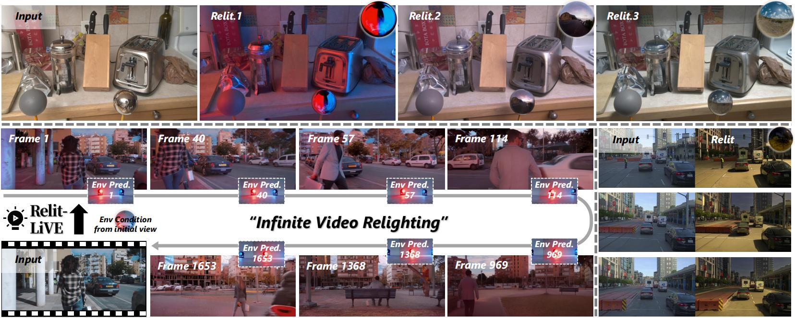

# Relit-LiVE: Relight Video by Jointly Learning Environment Video

<div align="center">
<a href='https://github.com/zhuxing0' target='_blank'>Weiqing Xiao</a><sup>1,*</sup>&emsp;<a href='https://github.com/Luh1124' target='_blank'>Hong Li</a><sup>2,3,*</sup>&emsp;Xiuyu Yang<sup>4,*</sup>&emsp;<a href='https://github.com/houyuanchen111' target='_blank'>Houyuan Chen</a><sup>5</sup>&emsp;Wenyi Li<sup>6</sup>&emsp;Tianqi Liu<sup>7</sup>&emsp;Shaocong Xu<sup>2</sup>&emsp;<a href='https://hugoycj.github.io/' target='_blank'>Chongjie Ye</a><sup>8</sup>&emsp;<a href='https://sites.google.com/view/fromandto' target='_blank'>Hao Zhao</a><sup>4,2,†</sup>&emsp;Beibei Wang<sup>1,†</sup>
</div>

<div align="center">
<sup>1</sup>Nanjing University&emsp;<sup>2</sup>BAAI&emsp;<sup>3</sup>Beihang University&emsp;<sup>4</sup>Tsinghua University&emsp;<sup>5</sup>HKUST&emsp;<sup>6</sup>UCAS&emsp;<sup>7</sup>HUST&emsp;<sup>8</sup>CUHK-Shenzhen<br>
<sup>*</sup>Equal contribution.&emsp;<sup>†</sup>Corresponding authors.
</div>

<p align="center">
  &emsp;
  &emsp;
  &emsp;
  
</p>

<p align="center">
  <a href="https://arxiv.org/pdf/2605.06658">
    
  </a>
  <a href="https://zhuxing0.github.io/projects/Relit-LiVE/">
    
  </a>
  <a href="https://huggingface.co/weiqingXiao/Relit-LiVE">
    
  </a>
  <a href="https://www.apache.org/licenses/LICENSE-2.0">
    
  </a>
</p>

This repo contains the official code of our paper: [Relit-LiVE: Relight Video by Jointly Learning Environment Video](https://arxiv.org/pdf/2605.06658).

## 📊 Overview

<p align="center">
  
</p>

We present **Relit-LiVE**, a novel video relighting framework that produces physically consistent and temporally stable results without needing prior knowledge of camera pose. This is achieved by jointly generating relighting videos and environment videos. Additionally, by integrating real-world lighting effects with intrinsic constraints, the relighting videos demonstrate remarkable physical plausibility, showcasing realistic reflections and shadows.

## ✨ News

- May 8, 2026: Release project page and infer pipeline.

## 📝 Check list

- [x] Release `the arxiv` and `project page`.
- [x] Release `inference code` and `model checkpoints`.
- [ ] Release `gradio code` and `complete inverse-forward pipeline`.
- [ ] Release `training code` and `data pipeline`.
- [ ] Release `training dataset`.

---

## 🛠️ Installation

### Minimum requirements

- Python 3.10
- NVIDIA GPU, with at least 24 GB VRAM recommended
- CUDA 12.4 or a compatible version
- Model weights prepared under `checkpoints/` and `models/Wan-AI/Wan2.1-T2V-1.3B/`

Recommended environment:

- Ubuntu 20.04 or newer
- Single-GPU CUDA inference setup

### Conda environment

```bash
conda create -n diffsynth python=3.10
conda activate diffsynth
pip install -e .
pip install lightning pandas websockets
pip install pyexr
pip install natsort
pip install -U deepspeed
pip install transformers==4.50.0
pip install dashscope
pip install gradio
```

## 📦 Checkpoints

Download the **Relit-LiVE** checkpoints from Hugging Face and place them under `checkpoints/`.

| Checkpoint | Resolution | Frames | Download |
| :--- | :---: | :---: | :---: |
| `model_frame25_480_832.ckpt` | 480 × 832 | 8n+1, n∈{0,1,2,3} → 1/9/17/25 | [🤗 Download](https://huggingface.co/weiqingXiao/Relit-LiVE) |
| `model_frame57_480_832.ckpt` | 480 × 832 | 8n+1, n∈{0,…,7} → 1/9/…/57 | [🤗 Download](https://huggingface.co/weiqingXiao/Relit-LiVE) |
| `model_frame1_1024_1472.ckpt` | 1024 × 1472 | 1 (image) | [🤗 Download](https://huggingface.co/weiqingXiao/Relit-LiVE) |

In addition, inference loads the Wan2.1 base model from `models/Wan-AI/Wan2.1-T2V-1.3B/`. Make sure all weights are in place before running inference.

## 🚀 Inference

By default, generated results are written to `inference_output/`.

### Basic 25-frame relighting

```bash
python relit_inference.py \
    --dataset_path datasets/demos \
    --ckpt_path checkpoints/model_frame25_480_832.ckpt \
    --output_dir inference_output \
    --cfg_scale 1.0 \
    --height 480 \
    --width 832 \
    --num_frames 25 \
    --padding_resolution \
    --use_ref_image \
    --env_map_path datasets/envs/Pink_Sunrise \
    --frame_interval 1 \
    --num_inference_steps 50 \
    --quality 10
```

### 25-frame rotating-light relighting

```bash
python relit_inference.py \
    --dataset_path datasets/demos \
    --ckpt_path checkpoints/model_frame25_480_832.ckpt \
    --output_dir inference_output \
    --cfg_scale 1.0 \
    --height 480 \
    --width 832 \
    --num_frames 25 \
    --padding_resolution \
    --use_ref_image \
    --env_map_path datasets/envs/Pink_Sunrise \
    --frame_interval 1 \
    --num_inference_steps 50 \
    --use_rotate_light \
    --quality 10
```

### Fixed-frame relighting with width-axis light rotation

```bash
python relit_inference.py \
    --dataset_path datasets/demos \
    --ckpt_path checkpoints/model_frame25_480_832.ckpt \
    --output_dir inference_output \
    --cfg_scale 1.0 \
    --height 480 \
    --width 832 \
    --num_frames 25 \
    --padding_resolution \
    --use_ref_image \
    --env_map_path datasets/envs/Pink_Sunrise \
    --frame_interval 1 \
    --num_inference_steps 50 \
    --use_fixed_frame_and_w_rotate_light \
    --quality 10
```

### Fixed-frame relighting with height-axis light rotation

```bash
python relit_inference.py \
    --dataset_path datasets/demos \
    --ckpt_path checkpoints/model_frame25_480_832.ckpt \
    --output_dir inference_output \
    --cfg_scale 1.0 \
    --height 480 \
    --width 832 \
    --num_frames 25 \
    --padding_resolution \
    --use_ref_image \
    --env_map_path datasets/envs/Pink_Sunrise \
    --frame_interval 1 \
    --num_inference_steps 50 \
    --use_fixed_frame_and_h_rotate_light \
    --quality 10
```

### 57-frame video relighting

```bash
python relit_inference.py \
    --dataset_path datasets/demos \
    --ckpt_path checkpoints/model_frame57_480_832.ckpt \
    --output_dir inference_output \
    --cfg_scale 1.0 \
    --height 480 \
    --width 832 \
    --num_frames 57 \
    --padding_resolution \
    --use_ref_image \
    --env_map_path datasets/envs/Pink_Sunrise \
    --frame_interval 1 \
    --num_inference_steps 50 \
    --quality 10
```

### Single-frame high-resolution relighting

```bash
python relit_inference.py \
    --dataset_path datasets/demos \
    --ckpt_path checkpoints/model_frame1_1024_1472.ckpt \
    --output_dir inference_output \
    --cfg_scale 1.0 \
    --height 1024 \
    --width 1472 \
    --num_frames 1 \
    --padding_resolution \
    --use_ref_image \
    --env_map_path datasets/envs/Pink_Sunrise \
    --frame_interval 1 \
    --num_inference_steps 50 \
    --quality 10
```

## 📋 Argument reference

The following arguments are defined in `parse_args()` inside `relit_inference.py`.

| Argument | Type | Default | Description |
| --- | --- | --- | --- |
| `--dataset_path` | str | `./example_test_data` | Input dataset directory. The examples above use `datasets/demos`. |
| `--env_map_path` | str | `None` | External environment map directory. If not provided, the script reads lighting data from each sample. |
| `--use_ref_image` | flag | `False` | Enable the reference-image branch. |
| `--use_muti_ref_image` | flag | `False` | Enable multi-reference-image mode. The argument name follows the current code spelling. |
| `--ref_image_path_with_idddx` | str | `None` | Template path for external reference images. The script replaces `idddx` with the sample index. |
| `--full_resolution` | flag | `False` | Use the full-resolution input pipeline. |
| `--padding_resolution` | flag | `False` | Use a padding-based resize strategy to reduce aggressive cropping. |
| `--dataset_type` | str | `relit-live` | Dataset format. The default matches the Relit-LiVE directory structure in this repository. |
| `--drop_mr` | flag | `False` | Ignore metallic and roughness conditioning. |
| `--use_rotate_light` | flag | `False` | Enable dynamic light rotation mode. |
| `--use_fixed_frame_and_w_rotate_light` | flag | `False` | Keep the first frame fixed and rotate lighting along the environment-map width axis. |
| `--use_fixed_frame_and_h_rotate_light` | flag | `False` | Keep the first frame fixed and rotate lighting along the environment-map height axis. |
| `--h_rotate_light` | int | `0` | Apply vertical environment-map rotation to each frame, in degrees. |
| `--w_rotate_light` | int | `0` | Apply horizontal environment-map rotation to each frame, in pixels. |
| `--num_frames` | int | `81` | Number of output frames. When set to `1`, the script saves a png; otherwise it saves an mp4. |
| `--num_inference_steps` | int | `50` | Number of denoising inference steps. |
| `--frame_interval` | int | `1` | Sampling interval when reading the input video or image sequence. |
| `--height` | int | `480` | Output height. |
| `--width` | int | `832` | Output width. |
| `--ckpt_path` | str | `None` | Path to the checkpoint to load. |
| `--output_dir` | str | `./results` | Default output directory. |
| `--output_path` | str | `None` | Explicit output file path. Only `.mp4` and `.png` are supported. |
| `--dataloader_num_workers` | int | `1` | Number of DataLoader workers. |
| `--cfg_scale` | float | `5.0` | Classifier-free guidance scale. |
| `--wo_ref_weight` | float | `0.0` | Weight for the branch without reference-image conditioning. |
| `--quality` | int | `5` | Video quality value passed to `imageio` when saving mp4 files. |

### 📌 Notes

- Output filenames automatically include parts of the checkpoint name, sequence name, resolution, reference-image mode, environment lighting information, inference steps, frame count, and `cfg_scale`.
- When `--num_frames 1` is used, the script writes a png. When `--num_frames > 1`, it writes an mp4.

## 🤝 Citation

If you find this repository helpful, please consider citing our paper:

```bibtex

```

## 📝 Acknowledgements

Code is built on [DiffSynth-Studio](https://github.com/modelscope/DiffSynth-Studio) and [diffusion-renderer](https://github.com/nv-tlabs/cosmos-transfer1-diffusion-renderer). Thanks all the authors for their excellent contributions!